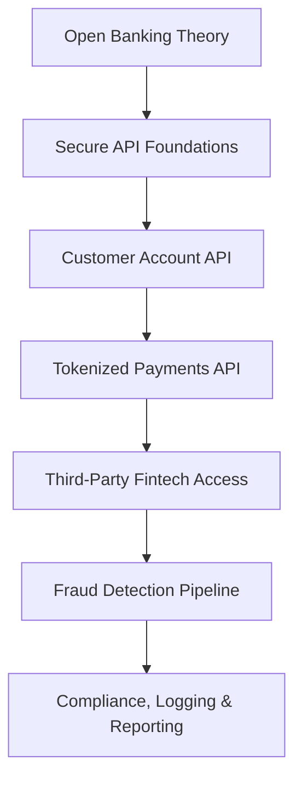

# 🏦 AWS Banking Security Lab

A complete **Open Banking + PCI DSS–inspired** AWS security course.

This repository is structured as a *textbook-style directory*: every topic, lab, and theory module is clickable and backed by diagrams. It simulates a **modern digital bank** exposing regulated APIs to customers and third‑party fintech providers on Amazon Web Services.

---

## 📘 1. Course Overview



You will design and build:

- Open Banking–style APIs on **Amazon API Gateway**
- Authentication & authorization with **Amazon Cognito (OAuth2/OIDC)**
- Banking microservices with **AWS Lambda**
- Tokenization vaults with **AWS KMS** and **Amazon DynamoDB**
- Logging & compliance with **CloudTrail, CloudWatch & Athena**

You will work from **WSL (Ubuntu)** using the AWS CLI and `nano` editor.

---

## 📚 2. Textbook‑Style Directory (Clickable)

Use this README as your **living directory**.

### 2.1 Theory Modules

1. **[01 – Open Banking & API Economy Overview](./theory/01-open-banking-overview.md)**  
2. **[02 – API Security Foundations (TLS, OAuth2, mTLS)](./theory/02-api-security-foundations.md)**  
3. **[03 – AWS Regulatory Controls: PCI, Open Banking & FSI Lens](./theory/03-aws-regulatory-controls-pci-openbanking.md)**  
4. **[04 – KMS Encryption & Tokenization Vault Design](./theory/04-kms-encryption-and-tokenization.md)**  
5. **[05 – Logging, Monitoring & Compliance on AWS](./theory/05-logging-monitoring-and-compliance.md)**  

### 2.2 Hands‑On Labs

- **[Lab 01 – Secure Customer Account API](./labs/lab01-secure-customer-account-api/README.md)**  
- **[Lab 02 – Tokenized Payments API](./labs/lab02-tokenized-payments-api/README.md)**  
- **[Lab 03 – Third‑Party Fintech Access (Open Banking)](./labs/lab03-openbanking-third-party-access/README.md)**  
- **[Lab 04 – Fraud Detection Signals](./labs/lab04-fraud-detection-signals/README.md)**  
- **[Lab 05 – Compliance Logging & Reporting](./labs/lab05-compliance-logging-and-reporting/README.md)**  

### 2.3 Security Controls Library

- **[IAM Policies for Banking APIs](./security-controls/iam-policies.md)**  
- **[KMS Encryption & Key Policies](./security-controls/kms-controls.md)**  
- **[Network Controls (VPC, SG, NACL, WAF)](./security-controls/network-controls.md)**  
- **[Compliance Mappings (PCI, FSI, Open Banking)](./security-controls/compliance-mappings.md)**  

---

## 🧱 3. High‑Level Architecture

```mermaid
flowchart TD
  subgraph Clients
    C1[Customer Mobile / Web App]
    C2[Third‑Party Fintech (TPP)]
  end

  C1 -->|TLS + OAuth2| APIGW[(Amazon API Gateway)]
  C2 -->|mTLS + OAuth2 Client Credentials| APIGW

  APIGW --> Auth[Cognito JWT Authorizer]
  Auth --> L1[Lambda - Customer APIs]
  Auth --> L2[Lambda - Payments & Tokens]

  L2 --> DDB[(DynamoDB Token Vault)]
  L2 --> KMS[KMS CMK]

  APIGW --> Logs[API Access Logs]
  L1 --> CWLogs[CloudWatch Logs]
  L2 --> CWLogs

  Logs --> CT[CloudTrail / CloudTrail Lake]
  CWLogs --> CT
  CT --> Athena[Athena Queries]
  Athena --> Reports[Compliance & Audit Reports]
```

---

## ⚙️ 4. Terraform Layout

Infrastructure‑as‑code lives under `terraform/`:

- `terraform/api-gateway/` – API Gateway configuration  
- `terraform/cognito/` – Cognito User Pool & App Clients  
- `terraform/dynamodb/` – token vault tables  
- `terraform/kms/` – CMKs and key policies  
- `terraform/logging/` – CloudTrail, S3, Lake & Athena basics  

---

## 🛠 5. How to Use This Course

1. Read a **Theory** module.  
2. Follow the matching **Lab** to implement it on AWS.  
3. Consult the **Security Controls** and **Compliance Mappings** to connect what you built to PCI / Open Banking style requirements.  
4. Optionally codify the design with **Terraform**.

---

## ✅ 6. Prerequisites

- AWS account with free‑tier access  
- IAM user/role with permissions for Cognito, API Gateway, Lambda, DynamoDB, KMS, CloudTrail, CloudWatch  
- AWS CLI v2 configured in WSL (Ubuntu)  
- `git`, `nano`, and `curl` installed  
- (Optional) `terraform`

---

## 🏁 7. Next Step

Start with:

```bash
cd theory
nano 01-open-banking-overview.md
```

Then move to:

```bash
cd ../labs/lab01-secure-customer-account-api
nano README.md
```

As you work through the files, this repo becomes your **personal banking security textbook + hands‑on lab notebook**.
