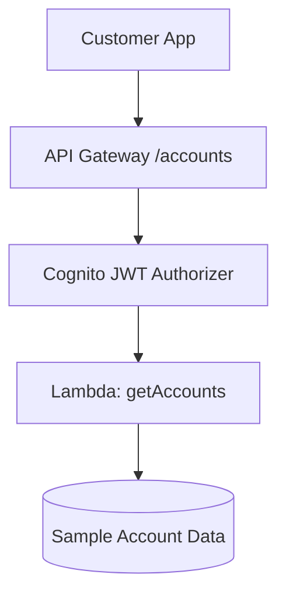

# Lab 01 – Secure Customer Account API\n\Scaffold placeholder for Lab 01.

In this lab you will build the first component of the AWS Banking Security Lab:  
a **customer-facing `/accounts` API** protected by **Amazon Cognito** and served through **Amazon API Gateway**, backed by a **Lambda microservice**.

This API simulates the type of resource every digital bank exposes:  
**account information for authenticated customers.**

---

# 🎯 1. Lab Objectives

By the end of this lab, you will be able to:

- Create and configure **Cognito User Pools** and **App Clients**
- Implement a **Lambda microservice** for account data
- Expose the microservice via **API Gateway**
- Protect the API using a **JWT Authorizer**
- Authenticate and invoke the API end-to-end using real tokens

This becomes the foundation for later labs:

- Tokenized payments (Lab 02)  
- Third-party fintech access (Lab 03)  
- Fraud detection (Lab 04)  
- Compliance logging (Lab 05)

---

# 🧱 2. Architecture Overview

---

This flow models a standard customer-initiated Open Banking flow:
authentication → authorization → API → microservice → response.

---

# 🛠️ 3. Prerequisites

Before you start:

Region: us-east-2 (Ohio)

AWS CLI v2 installed in WSL

Logged in as:
IAM User: olumide-admin
Account ID: 698135531490

Git repo cloned locally

Verify AWS CLI:

aws sts get-caller-identity

# 🔐 4. Create the Cognito User Pool
## 4.1 Create a new User Pool

AWS Console → Amazon Cognito → Create User Pool

Setting	Value
Name	banking-customers-pool
Sign-in option	Email
MFA	Optional (enable later)
Password policy	Default

Create the pool and note the User Pool ID.

## 4.2 Create an App Client

Inside the pool:

App integration → App clients → Create app client

Name: banking-web-client

Do NOT enable a client secret (public client)

OAuth 2.0 flows:

✔ Authorization code

✔ Implicit

OAuth scopes:

openid

email

profile

Callback URL (temporary):
https://example.com/callback

Logout URL:
https://example.com/logout

Save and note the Client ID.

## 4.3 Create a test user

Inside the pool:

Create user

Email: your address

Mark “email verified”

Set a password

# ⚙️ 5. Create the Lambda Microservice

We build a simple Lambda returning fake banking accounts.

## 5.1 Create IAM role for Lambda

Create trust policy:

cat > trust-policy.json << 'EOF2'
{
  "Version": "2012-10-17",
  "Statement": [
    {
      "Effect": "Allow",
      "Principal": { "Service": "lambda.amazonaws.com" },
      "Action": "sts:AssumeRole"
    }
  ]
}
EOF2

Create role:

aws iam create-role \
  --role-name banking-lambda-execution-role \
  --assume-role-policy-document file://trust-policy.json

Attach basic Lambda execution policy:

aws iam attach-role-policy \
  --role-name banking-lambda-execution-role \
  --policy-arn arn:aws:iam::aws:policy/service-role/AWSLambdaBasicExecutionRole

## 5.2 Create Lambda source code
mkdir -p lambda-src
cat > lambda-src/app.py << 'EOF2'
import json

def lambda_handler(event, context):
    accounts = [
        {"accountId": "CHK-001", "type": "Checking", "balance": 1250.55, "currency": "USD"},
        {"accountId": "SAV-001", "type": "Savings", "balance": 8900.00, "currency": "USD"}
    ]
    return {
        "statusCode": 200,
        "headers": { "Content-Type": "application/json" },
        "body": json.dumps({"accounts": accounts})
    }
EOF2

Package:

cd lambda-src
zip function.zip app.py
cd ..

## 5.3 Deploy Lambda
aws lambda create-function \
  --function-name banking-get-accounts \
  --runtime python3.11 \
  --handler app.lambda_handler \
  --role arn:aws:iam::698135531490:role/banking-lambda-execution-role \
  --zip-file fileb://lambda-src/function.zip

# 🌐 6. Create the API Gateway Endpoint
## 6.1 Create the API
aws apigatewayv2 create-api \
  --name "Banking Accounts API" \
  --protocol-type HTTP \
  --target arn:aws:lambda:us-east-2:698135531490:function:banking-get-accounts

Save the returned ApiId:

export API_ID=<api-id>

## 6.2 Add /accounts route
aws apigatewayv2 create-route \
  --api-id $API_ID \
  --route-key "GET /accounts" \
  --target "integrations/$(aws apigatewayv2 get-routes --api-id $API_ID --query 'Items[0].Target' --

# 🔒 7. Secure the API with Cognito
## 7.1 Get Cognito details
export USER_POOL_ID=<your-user-pool-id>
export USER_POOL_CLIENT_ID=<your-client-id>
export COGNITO_ISSUER="https://cognito-idp.us-east-2.amazonaws.com/$USER_POOL_ID"

## 7.2 Create JWT Authorizer
aws apigatewayv2 create-authorizer \
  --api-id $API_ID \
  --authorizer-type JWT \
  --name "CognitoAccountsAuthorizer" \
  --identity-source '$request.header.Authorization' \
  --jwt-configuration "Issuer=$COGNITO_ISSUER,Audience=$USER_POOL_CLIENT_ID"

Capture the authorizer ID:

export AUTHORIZER_ID=<value>

## 7.3 Apply authorizer to /accounts

Find the route ID:

aws apigatewayv2 get-routes \
  --api-id $API_ID \
  --query "Items[?RouteKey=='GET /accounts'].RouteId" --output text

Then apply:

export ROUTE_ID=<value>

aws apigatewayv2 update-route \
  --api-id $API_ID \
  --route-id $ROUTE_ID \
  --authorization-type JWT \
  --authorizer-id $AUTHORIZER_ID

Deploy:

aws apigatewayv2 create-deployment --api-id $API_ID

# 🔑 8. Get a Token & Test the API
## 8.1 Authenticate and obtain token
aws cognito-idp initiate-auth \
  --auth-flow USER_PASSWORD_AUTH \
  --client-id $USER_POOL_CLIENT_ID \
  --auth-parameters USERNAME=<your-email>,PASSWORD=<your-password>

Extract the IdToken:

export ID_TOKEN=<paste-token-here>

## 8.2 Call your API

Get the API URL:

aws apigatewayv2 get-apis --query "Items[?ApiId=='$API_ID'].ApiEndpoint" --output text

Test:

curl -s -H "Authorization: Bearer $ID_TOKEN" "$API_URL/accounts" | jq

Expected:

{
  "accounts": [
    { "accountId": "CHK-001", "type": "Checking", "balance": 1250.55 },
    { "accountId": "SAV-001", "type": "Savings", "balance": 8900.00 }
  ]
}

# 📘 9. Regulatory Callouts

TLS + JWT meets PCI DSS requirement 4 (protect data in transit).

Cognito strongly supports SCA concepts used in Open Banking.

CloudTrail logs every Lambda invocation and auth flow → used in Lab 05.

# 🎉 10. Lab Completed

You now have a working, secure banking API — the foundation for tokenization, fintech access, fraud detection, and compliance.

Proceed to Lab 02 – Tokenized Payments API.
