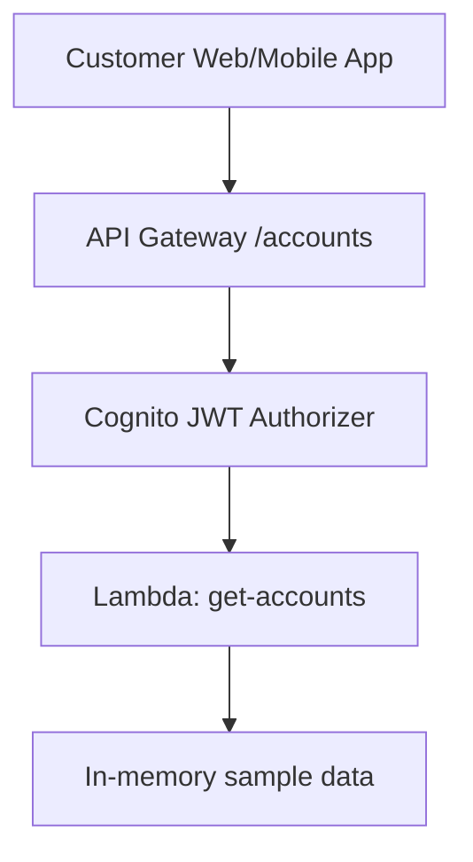

# Lab 01 – Secure Customer Account API

**Goal:** Build a `/accounts` API protected by **Amazon Cognito + API Gateway** with a **Lambda** backend.

You will:

1. Create a **Cognito User Pool** and **App Client**.
2. Create a **Lambda** function that returns sample account data.
3. Expose the Lambda via **API Gateway**.
4. Protect the API with a **Cognito JWT authorizer**.
5. Test end-to-end with the **AWS CLI / curl**.

Assumptions:

- Region: **us-east-2 (Ohio)**
- IAM user: **`olumide-admin`**
- You are running commands from **WSL (Ubuntu)** with AWS CLI v2 configured.

---

## 0. Architecture at a Glance

---

1. Create a Cognito User Pool
1.1 Console steps
Go to Amazon Cognito → User pools → Create user pool.

Name: banking-customers-pool.

Choose Email as sign-in option.

For simplicity, allow User name and email.

Password policy: keep defaults for the lab.

MFA: optional (you can enable later).

Click Create user pool.

1.2 Create an App Client (User Pool client)
Inside the new pool, go to App integration → App clients.

Click Create app client.

Name: banking-web-client.

Enable Generate a client secret = off (public client).

Allowed OAuth grant types: Authorization code, Implicit (for lab).

Allowed OAuth scopes: select at least:

openid

email

profile

Callback URL: for now you can set https://example.com/callback.

Sign-out URL: https://example.com/logout.

Save.

💡 Later labs can add resource server + custom scopes like accounts.read.

1.3 Create a Test User
In the pool, go to Users → Create user.

Email: use your own email.

Mark Email verified for convenience.

Set a password that meets the policy.

2. Create the Lambda Backend
We'll create a basic Lambda that returns mock account data.

2.1 Create IAM Role for Lambda (CLI)
bash
Copy code
cat > trust-policy.json << 'EOF'
{
  "Version": "2012-10-17",
  "Statement": [
    {
      "Effect": "Allow",
      "Principal": { "Service": "lambda.amazonaws.com" },
      "Action": "sts:AssumeRole"
    }
  ]
}
EOF

aws iam create-role \
  --role-name banking-lambda-execution-role \
  --assume-role-policy-document file://trust-policy.json
Attach basic execution policy:

bash
Copy code
aws iam attach-role-policy \
  --role-name banking-lambda-execution-role \
  --policy-arn arn:aws:iam::aws:policy/service-role/AWSLambdaBasicExecutionRole
2.2 Create Lambda Function (Python)
Create a simple handler file:

bash
Copy code
mkdir -p lambda-src
cat > lambda-src/app.py << 'EOF'
import json

def lambda_handler(event, context):
    # Simulated accounts for the authenticated user
    accounts = [
        {"accountId": "CHK-001", "type": "Checking", "balance": 1250.55, "currency": "USD"},
        {"accountId": "SAV-001", "type": "Savings", "balance": 8900.00, "currency": "USD"}
    ]

    return {
        "statusCode": 200,
        "headers": { "Content-Type": "application/json" },
        "body": json.dumps({"accounts": accounts})
    }
EOF
Zip and create the Lambda:

bash
Copy code
cd lambda-src
zip function.zip app.py
cd ..

aws lambda create-function \
  --function-name banking-get-accounts \
  --runtime python3.11 \
  --handler app.lambda_handler \
  --role arn:aws:iam::698135531490:role/banking-lambda-execution-role \
  --zip-file fileb://lambda-src/function.zip
(Replace account ID if yours differs.)

3. Create the API Gateway Endpoint
We’ll use a simple HTTP API or REST API; here we outline HTTP API (v2).

3.1 Create HTTP API with Lambda Integration
bash
Copy code
aws apigatewayv2 create-api \
  --name "Banking Accounts API" \
  --protocol-type HTTP \
  --target arn:aws:lambda:us-east-2:698135531490:function:banking-get-accounts
Note the returned ApiId – export it:

bash
Copy code
export API_ID=<ApiId-from-output>
By default this creates a ANY / route. For clarity, add /accounts:

bash
Copy code
aws apigatewayv2 create-route \
  --api-id $API_ID \
  --route-key "GET /accounts" \
  --target "integrations/$(aws apigatewayv2 get-routes --api-id $API_ID --query 'Items[0].Target' --output text | cut -d/ -f2)"
(You can also do this step via console if easier.)

4. Protect the API with Cognito (JWT Authorizer)
For HTTP APIs, you create a JWT authorizer pointing at Cognito.

4.1 Get User Pool & App Client IDs
In the console or via CLI:

bash
Copy code
aws cognito-idp list-user-pools --max-results 10
aws cognito-idp list-user-pool-clients --user-pool-id <UserPoolId>
Set:

bash
Copy code
export USER_POOL_ID=<your-user-pool-id>
export USER_POOL_CLIENT_ID=<your-app-client-id>
export COGNITO_ISSUER="https://cognito-idp.us-east-2.amazonaws.com/$USER_POOL_ID"
4.2 Create JWT Authorizer
bash
Copy code
aws apigatewayv2 create-authorizer \
  --api-id $API_ID \
  --authorizer-type JWT \
  --name "CognitoAccountsAuthorizer" \
  --identity-source '$request.header.Authorization' \
  --jwt-configuration "Issuer=$COGNITO_ISSUER,Audience=$USER_POOL_CLIENT_ID"
Note the AuthorizerId and export it:

bash
Copy code
export AUTHORIZER_ID=<AuthorizerId-from-output>
4.3 Attach Authorizer to /accounts Route
Get the route ID for GET /accounts:

bash
Copy code
aws apigatewayv2 get-routes \
  --api-id $API_ID \
  --query "Items[?RouteKey=='GET /accounts'].RouteId" \
  --output text
Then:

bash
Copy code
export ROUTE_ID=<route-id>

aws apigatewayv2 update-route \
  --api-id $API_ID \
  --route-id $ROUTE_ID \
  --authorization-type JWT \
  --authorizer-id $AUTHORIZER_ID
Deploy (if not auto-deployed):

bash
Copy code
aws apigatewayv2 create-deployment --api-id $API_ID
5. Get a Token and Test the API
5.1 Get an ID/Access Token (Quick Path)
For the lab you can use “Hosted UI” or the AdminInitiateAuth API.
A simple CLI way (for password auth) is:

bash
Copy code
aws cognito-idp initiate-auth \
  --auth-flow USER_PASSWORD_AUTH \
  --client-id $USER_POOL_CLIENT_ID \
  --auth-parameters USERNAME=<your-username>,PASSWORD=<your-password>
From the JSON output, grab AuthenticationResult.IdToken (or AccessToken if you configured authorizer for that).

Export:

bash
Copy code
export ID_TOKEN=<copied-id-token>
5.2 Call the API
Get your API’s invoke URL from the console or:

bash
Copy code
aws apigatewayv2 get-apis --query "Items[?ApiId=='$API_ID'].ApiEndpoint" --output text
Save:

bash
Copy code
export API_URL=<https-endpoint-from-output>
Call the endpoint:

bash
Copy code
curl -s -H "Authorization: Bearer $ID_TOKEN" "$API_URL/accounts" | jq
You should see:

json
Copy code
{
  "accounts": [
    { "accountId": "CHK-001", "type": "Checking", "balance": 1250.55, "currency": "USD" },
    { "accountId": "SAV-001", "type": "Savings", "balance": 8900.0, "currency": "USD" }
  ]
}
6. Regulatory Call-outs
TLS + JWT authorizer → supports protecting data in transit and strong auth.

Least-privilege Lambda role → only logging + execution perms.

CloudWatch logs for Lambda and API → can be queried later in Lab 05.

You now have a secure, Cognito-protected banking API as the foundation for the rest of the course.
