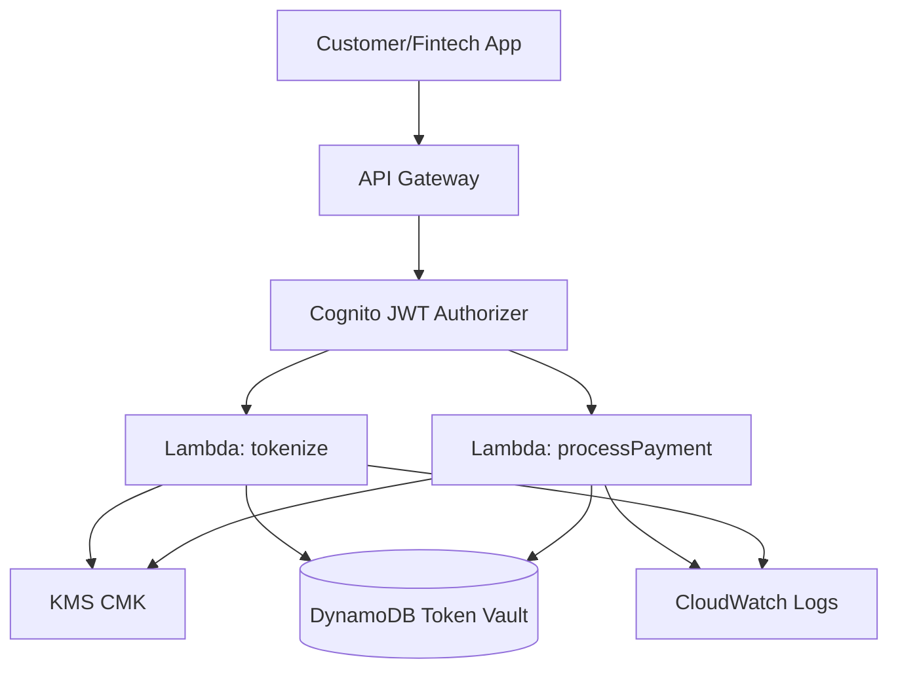

# Lab 02 – Tokenized Payments API

In this lab, you extend the banking platform by introducing a **Payment Tokenization Vault**, a core component of PCI-aligned financial architectures.

You will create a **KMS-backed tokenization system** that stores encrypted account/PAN-like data in **DynamoDB**, then expose secure `/tokenize` and `/payments` endpoints through **API Gateway**.

This is the foundation for real-world payment flows, fraud detection (Lab 04), and compliance logging (Lab 05).

---

# 🎯 1. Lab Objectives

By the end of this lab, you will:

- Understand **tokenization** and why banks use it  
- Build a **token vault** using KMS + DynamoDB  
- Create **Lambda microservices** for:
  - `/tokenize` (generate encrypted tokens)
  - `/payments` (detokenize + process payments)
- Secure the payments API with **JWT + scopes**
- Observe **KMS encryption events** in CloudTrail

---

# 🧠 2. Why Tokenization Matters (Analogy)

Think of raw account numbers as **master keys**.

You never hand those out.  
You hand out **keycards**, which map back to the real key in a secure vault.

Tokenization = converting real sensitive data → random tokens  
De-tokenization = secure lookup in vault + decrypt via KMS

This reduces PCI scope because most systems handle **tokens**, not raw data.

---

# 🧱 3. Architecture Overview

---

# 🔐 4. Create the Token Vault (KMS + DynamoDB)
## 4.1 Create a KMS CMK
Go to:
AWS Console → KMS → Create key

Key type: Symmetric

Key usage: Encrypt/Decrypt

Key name: banking-token-vault-key

Administrators: your IAM admin

Key users: Lambda execution roles only

Important:
Uncheck or remove aws/root from direct decrypt permissions if visible.

This enforces a strict “vault-only” model.

Copy the CMK ARN:

ruby
Copy code
arn:aws:kms:us-east-2:698135531490:key/<key-id>
We will call it:

nginx
Copy code
KMS_ARN_TOKEN_VAULT

## 4.2 Create DynamoDB Token Vault
Go to:
DynamoDB → Create Table

Field	Value
Table name	tokenization-vault
Partition key	token (String)

Keep default settings (pay-per-request).

Table items will look like:

| token | ciphertext | created_at | last4 | metadata |

Only the “ciphertext” column will ever contain encrypted account data.

# ⚙️ 5. Lambda Functions
We create two microservices:

tokenize – receives { "accountNumber": "123..." }, encrypts it with KMS, returns { "token": "xyz123" }

processPayment – receives { "token": "xyz123", "amount": 100 }, detokenizes inside Lambda, “processes” payment, returns success

The payment logic will be simulated (no real movement of funds).

## 5.1 IAM Role for Both Lambdas
Role name: banking-payments-role

Attach:

AWSLambdaBasicExecutionRole

DynamoDB read/write access to tokenization-vault

Grant decrypt/encrypt permission on the CMK

Key policy must explicitly allow:

json
Copy code
{
  "Effect": "Allow",
  "Principal": { "AWS": "arn:aws:iam::698135531490:role/banking-payments-role" },
  "Action": [
    "kms:Encrypt",
    "kms:Decrypt"
  ],
  "Resource": "*"
}

# 🧩 6. Lambda Source Code
Below are clean, modern, production-style Python Lambda functions.

## 6.1 tokenize Lambda
python
Copy code
import json, os, boto3, base64, uuid
from datetime import datetime

kms = boto3.client('kms')
ddb = boto3.resource('dynamodb')
table = ddb.Table('tokenization-vault')

KMS_KEY_ID = os.environ['KMS_ARN']

def lambda_handler(event, context):
    body = json.loads(event['body'])
    account = body.get('accountNumber')

    if not account:
        return {"statusCode": 400, "body": "Missing accountNumber"}

    # Encrypt with KMS
    resp = kms.encrypt(
        KeyId=KMS_KEY_ID,
        Plaintext=account.encode()
    )
    ciphertext = base64.b64encode(resp['CiphertextBlob']).decode()

    token = str(uuid.uuid4())
    last4 = account[-4:]

    table.put_item(Item={
        "token": token,
        "ciphertext": ciphertext,
        "last4": last4,
        "created_at": datetime.utcnow().isoformat()
    })

    return {
        "statusCode": 200,
        "body": json.dumps({"token": token, "last4": last4})
    }

## 6.2 processPayment Lambda
python
Copy code
import json, os, boto3, base64

kms = boto3.client('kms')
ddb = boto3.resource('dynamodb')
table = ddb.Table('tokenization-vault')

KMS_KEY_ID = os.environ['KMS_ARN']

def lambda_handler(event, context):
    body = json.loads(event['body'])
    token = body.get('token')
    amount = body.get('amount')

    if not token or not amount:
        return {"statusCode": 400, "body": "token and amount required"}

    item = table.get_item(Key={"token": token})
    if 'Item' not in item:
        return {"statusCode": 404, "body": "Invalid token"}

    ciphertext = base64.b64decode(item['Item']['ciphertext'])

    # Decrypt using KMS
    resp = kms.decrypt(CiphertextBlob=ciphertext)
    account = resp['Plaintext'].decode()

    # Simulate payment processing
    result = {
        "token": token,
        "account": f"****{item['Item']['last4']}",
        "amount": amount,
        "status": "APPROVED"
    }

    return {
        "statusCode": 200,
        "body": json.dumps(result)
    }

# 🌐 7. Create API Gateway Endpoints
Create two endpoints:

POST /tokenize

POST /payments

Both use Cognito JWT authorizer (from Lab 01).

Both integrate with their respective Lambda functions.

Recommended:
Use the REST API console (quickest) or API Gateway v2 HTTP routes.

# 🔑 8. Authentication & Authorization
You may optionally create custom OAuth2 scopes for payments:

Scope	Purpose
payments.tokenize	For /tokenize
payments.create	For /payments

Then bind scopes to routes in API Gateway.

This aligns with Open Banking PSD2 style permissions.

# 🧪 9. Test the Endpoints
## 9.1 Get JWT token (same as Lab 01)
Then:

Tokenize
bash
Copy code
curl -s -X POST "$API_URL/tokenize" \
  -H "Authorization: Bearer $ID_TOKEN" \
  -H "Content-Type: application/json" \
  -d '{"accountNumber":"1234567890123456"}' | jq
Example output:

json
Copy code
{
  "token": "6b7c...",
  "last4": "3456"
}
Payment
bash
Copy code
curl -s -X POST "$API_URL/payments" \
  -H "Authorization: Bearer $ID_TOKEN" \
  -H "Content-Type: application/json" \
  -d '{"token":"6b7c...", "amount": 250}' | jq
  
# 📊 10. Observe KMS Activity in CloudTrail
Open:
CloudTrail → Event history

Search:

makefile
Copy code
kms:Encrypt
kms:Decrypt
You should see:

Calls from tokenize Lambda

Calls from processPayment Lambda

This is foundational for Lab 05.

# 🏁 11. Lab Completed
You now have:

A fully functional token vault

Endpoints using tokenization + de-tokenization

KMS encryption/decryption

DynamoDB persistence

JWT-authenticated secure flows

A payments simulation suitable for fraud labs and audit labs

Proceed next to:

👉 Lab 03 – Third-Party Fintech Access (Open Banking)
