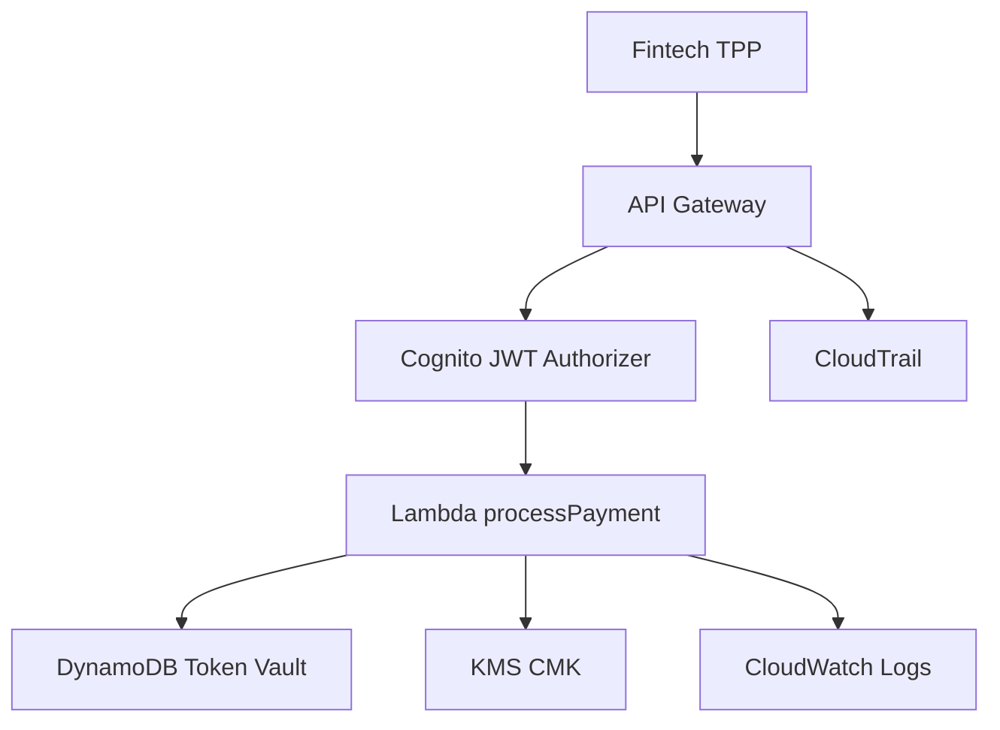

# Lab 03 – Third-Party Fintech Access (Open Banking)

In this lab, you extend the banking platform to support **regulated Third-Party Providers (TPPs)** — a core requirement of Open Banking frameworks like PSD2, Open Banking UK, CDR (Australia), and Brazil Open Finance.

Unlike customer-driven flows (Lab 01 + Lab 02), TPPs authenticate using **OAuth2 Client Credentials** and (optionally) **Mutual TLS (mTLS)** for high-trust, server–server API access.

This lab teaches the separation between:
- **Customer-initiated** traffic  
- **Fintech-initiated** traffic  

A critical architectural boundary in modern financial APIs.

---

# 🎯 1. Lab Objectives

By the end of this lab, you will:

- Create a **TPP identity** (machine-to-machine client) in Cognito  
- Generate **Client ID + Client Secret** for OAuth2 Client Credentials flow  
- Protect specific routes (e.g. `/payments`) so **only the TPP** can call them  
- Implement authorization based on **OAuth scopes**  
- (Optional Advanced) Enforce **mTLS** on the API Gateway domain  
- Log and analyze TPP invocations for future fraud/compliance labs  

This lab completes the core architecture needed for real Open Banking.

---

# 🧠 2. Why TPP Access Is Different

### Customer flow (Labs 1 & 2):
- Customer logs into your bank  
- Customer authorizes access  
- Customer receives tokens  
- Apps call APIs on the customer’s behalf  

### TPP flow (Open Banking):
TPPs are allowed to:
- Initiate payments  
- Retrieve account information  
- Access balances  
…but *only* with explicit customer consent and under regulatory supervision.

TPPs authenticate using:
- **OAuth2 Client Credentials Flow** → proves “I am a licensed fintech”  
- **mTLS** → proves “Here is my regulator-issued certificate”  

---

# 🧱 3. Architecture Overview

---

# 🔐 4. Create a Cognito App Client for TPP Access
This is a machine-to-machine OAuth2 client, not a human user.

## 4.1 Create App Client (Client Credentials Enabled)
Navigate to:

Cognito → User Pool → App integration → App clients → Create

Use the following settings:

Setting	Value
App name	openbanking-tpp-client
Generate client secret	✔ Yes
Allowed OAuth Flows	✔ Client Credentials
Allowed Scopes	payments.create (recommended)
Token expiration	Default

Important:
This TPP client should NOT use Authorization Code Flow.
It is strictly client_credentials.

Copy:

ClientId

ClientSecret

We will use these shortly.

# 🪪 5. (Optional but Recommended) Create a TPP Identity
Although Cognito doesn’t manage TPP “business identities,” you may want a DynamoDB table:

Table: tpp-directory

Key	Purpose
tppId	Unique identifier for fintech
companyName	Name of TPP
status	Approved / Suspended
contact	Email / phone

This lets you simulate:

Approved TPPs

Suspended TPPs

Rate limits per TPP

# 🔧 6. Apply OAuth2 Scopes to API Gateway Routes
In Lab 02, you created /payments.

Now restrict this route so only the TPP OAuth scope can access it.

## 6.1 Create a Resource Server (Optional but best practice)
In Cognito User Pool:

App Integration → Resource Servers → Create

Field	Value
Identifier	payments.api
Name	Payments API
Scopes	payments.create

## 6.2 Attach the scope to the TPP client
Open:
App client → OAuth2 settings → Add scope →
✔ payments.create

## 6.3 Enforce scope in API Gateway
In Cognito JWT Authorizer (API Gateway):

Allowed Scopes → payments.create

This guarantees:

TPPs may call /payments

Normal customers cannot

Tokens must include "scope": "payments.create"

# 🔑 7. Retrieve Token Using Client Credentials
TPPs obtain a token entirely server-side — no login.

Replace placeholders accordingly:

bash
Copy code
export CLIENT_ID="<TPP ClientId>"
export CLIENT_SECRET="<TPP ClientSecret>"
export COGNITO_DOMAIN="<your-cognito-domain>"
export TOKEN_URL="https://${COGNITO_DOMAIN}.auth.us-east-2.amazoncognito.com/oauth2/token"
Request token:

bash
Copy code
curl -X POST $TOKEN_URL \
  -H "Content-Type: application/x-www-form-urlencoded" \
  -d "grant_type=client_credentials&client_id=$CLIENT_ID&client_secret=$CLIENT_SECRET&scope=payments.create"
You will receive:

json
Copy code
{
  "access_token": "eyJraWQiOiJLT...",
  "expires_in": 3600,
  "token_type": "Bearer"
}
Export for future calls:

bash
Copy code
export TPP_TOKEN="<paste-access-token-here>"

# 💳 8. Call the /payments API as a TPP
Recall from Lab 02 that /payments accepts:

json
Copy code
{
  "token": "<vault-token>",
  "amount": 200
}
Make the call:

bash
Copy code
curl -s -X POST "$API_URL/payments" \
  -H "Authorization: Bearer $TPP_TOKEN" \
  -H "Content-Type: application/json" \
  -d '{"token":"<token-from-lab02>","amount":200}' | jq
If everything is configured correctly, you get:

json
Copy code
{
  "token": "8dd2-...",
  "account": "****1234",
  "amount": 200,
  "status": "APPROVED"
}

# 🔒 9. OPTIONAL — Add Mutual TLS (mTLS) for TPP Traffic
mTLS is the Open Banking gold standard.

## 9.1 Create a custom domain for your API
API Gateway → Custom domains → Create

Enable HTTPS 1.2

Upload or reference ACM certificate

## 9.2 Add a client certificate truststore
Format:

Copy code
Base64-encoded PEM certificates
Upload under:

mTLS → Client certificate truststore

## 9.3 Require mTLS on your stage
Navigate to:

Stages → Edit → mTLS → Require client certificate

Once active:

Calls WITHOUT the fintech certificate fail before hitting Lambda.

This is powerful.

# 🧪 10. Testing Matrix (Recommended)
Caller	Route	Expected Result
Customer token	/payments	❌ Forbidden (no payments.create scope)
Customer token	/accounts	✔ Allowed
TPP token	/payments	✔ Allowed
TPP token	/accounts	❌ Forbidden
TPP w/out certificate (if mTLS enabled)	/payments	❌ TLS handshake fails

This validates proper separation of concerns.

# 📊 11. Observe TPP Logs in CloudTrail
Search:

makefile
Copy code
cognito-idp:InitiateAuth
kms:Decrypt
lambda:Invoke
apigateway:*
These logs feed into Lab 05 for compliance analytics.

# 🏁 12. Lab Completed
You have now built:

A TPP client with OAuth2 Client Credentials

Scope-restricted Open Banking–style routes

Payments-only permissions

(Optional) Mutual TLS for high-trust access

Full TPP invocation logging

You now have a realistic multi-client Open Banking model.

Next up:

👉 Lab 04 – Fraud Detection Signals
