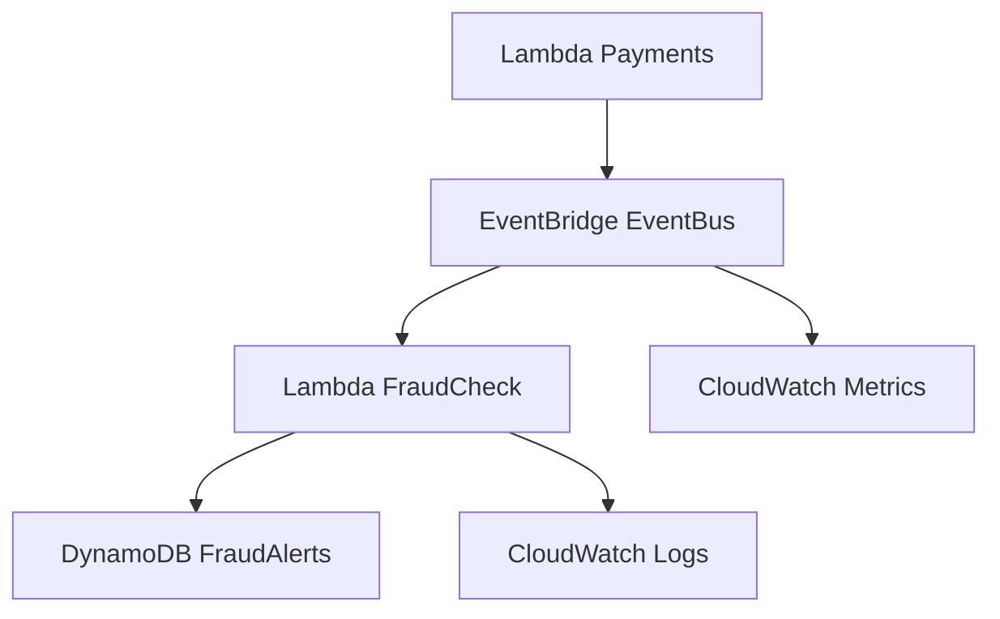

# Lab 04 – Fraud Detection Signals

In modern banking, fraud detection is not a batch job — it is **real-time** and **event-driven**.  
This lab extends the `/payments` architecture from Lab 02 + Lab 03 to add **fraud detection signals** using **Amazon EventBridge**, **Lambda**, and **DynamoDB**.

You will build a lightweight, real-time fraud engine capable of detecting suspicious payment behavior.

---

# 🎯 1. Lab Objectives

By the end of this lab, you will:

- Emit real-time **payment events** from the `/payments` Lambda  
- Route events through **EventBridge** (or Kinesis Streams)
- Write a **fraud-analysis Lambda** that flags suspicious activity
- Store fraud alerts in **DynamoDB**
- Publish metrics & logs used later in **Lab 05 (Compliance & Audit)**

This lab models the event-driven decisioning systems used by real banks.

---

# 🧠 2. Why Fraud Detection Is Event-Driven

Banks must detect fraud patterns such as:

- Too many payments in a short time  
- Payments from unusual locations  
- Large amounts inconsistent with typical behavior  
- Suspicious tokens or TPP patterns  

Batch systems catch fraud too late.  
**Events allow instant reaction.**

### Analogy — Airport Security “Behavior Detection Unit”
If someone keeps:
- Re-entering the checkpoint,
- Changing queue lines,
- Carrying strange items…

Security agents react *in real time* — not tomorrow.  
This is exactly the purpose of real-time fraud events.

---

# 🧱 3. Architecture Overview

---

This architecture mimics production-grade fraud signal systems.

# 🗄️ 4. Create the Fraud Alerts DynamoDB Table
Go to:
DynamoDB → Create Table

Field	Value
Table name	fraud-alerts
Partition key	alertId (String)

Leave defaults (pay-per-request).

Each fraud event will contain:

json
Copy code
{
  "alertId": "uuid",
  "token": "abc123",
  "amount": 2500,
  "reason": "High amount threshold",
  "timestamp": "2025-11-19T14:22:51Z"
}

# 🔧 5. Modify the /payments Lambda to Emit Events
Open your processPayment Lambda from Lab 02 and add:

python
Copy code
import boto3, json
eventbridge = boto3.client('events')
Emit after processing:

python
Copy code
eventbridge.put_events(
    Entries=[
        {
            "Source": "bank.payments",
            "DetailType": "PaymentEvent",
            "Detail": json.dumps({
                "token": token,
                "amount": amount
            })
        }
    ]
)
This turns every payment into a fraud-check event.

# 🚦 6. Create an EventBridge Bus (Optional but Recommended)
Console → EventBridge → Buses → Create

Name: banking-payments-bus

(You may also use default, but a dedicated bus is cleaner.)

# 🎛️ 7. Create an Event Rule for Fraud Detection
EventBridge → Rules → Create rule

Name: fraud-detection-rule

Event pattern:

json
Copy code
{
  "source": ["bank.payments"],
  "detail-type": ["PaymentEvent"]
}
Target = Lambda fraudCheck

# 🧩 8. Create the FraudCheck Lambda
Create file fraudCheck.py:

python
Copy code
import json, uuid, time, boto3
from datetime import datetime

ddb = boto3.resource('dynamodb')
table = ddb.Table('fraud-alerts')

def lambda_handler(event, context):
    alerts = []

    for record in event.get("Records", []):
        detail = json.loads(record["detail"])
        token = detail["token"]
        amount = detail["amount"]

        # Basic rules (expand over time)
        if amount > 5000:
            alerts.append({
                "alertId": str(uuid.uuid4()),
                "token": token,
                "amount": amount,
                "reason": "High amount threshold",
                "timestamp": datetime.utcnow().isoformat()
            })

        if amount < 0:
            alerts.append({
                "alertId": str(uuid.uuid4()),
                "token": token,
                "amount": amount,
                "reason": "Negative amount anomaly",
                "timestamp": datetime.utcnow().isoformat()
            })

    # Write alerts to DynamoDB
    for a in alerts:
        table.put_item(Item=a)

    return {
        "statusCode": 200,
        "body": json.dumps({"alerts_created": len(alerts)})
    }
Attach an IAM policy to allow:

dynamodb:PutItem on fraud-alerts

CloudWatch logging

# 🧪 9. Testing the Fraud Pipeline

## 9.1 Run a “normal” payment
bash
Copy code
curl -s -X POST "$API_URL/payments" \
  -H "Authorization: Bearer $TOKEN" \
  -H "Content-Type: application/json" \
  -d '{"token":"abc123", "amount": 150}' | jq
Expect: no fraud alert.

## 9.2 Run a suspicious payment
bash
Copy code
curl -s -X POST "$API_URL/payments" \
  -H "Authorization: Bearer $TOKEN" \
  -H "Content-Type: application/json" \
  -d '{"token":"abc123", "amount": 9000}' | jq
Now check DynamoDB:

You should see entries in fraud-alerts.

# 📊 10. Observe Events, Metrics & Logs
CloudWatch Logs
View logs for:

processPayment

fraudCheck

CloudTrail
Filter by:

makefile
Copy code
PutEvents
lambda:Invoke
dynamodb:PutItem
EventBridge Metrics
You’ll see:

Invocations

Matched events

Failed invocations

This provides the raw material for Lab 05.

# 🏁 11. Lab Completed
You have now implemented:

Event-driven fraud detection

EventBridge streaming

Payment event logging

Real-time fraud rule evaluation

Fraud alerts in DynamoDB

Log + metric observability

This architecture is the basis for real risk engines used by banks worldwide.

Next up:

👉 Lab 05 – Compliance Logging & Reporting
(CloudTrail Lake + Athena queries + evidence generation)
