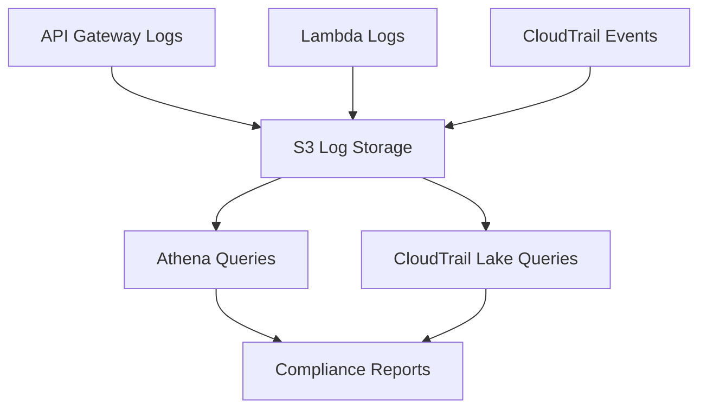

# Lab 05 – Compliance Logging & Reporting

Financial systems must prove, not assume, that controls are working.  
This lab focuses on **collecting, querying, and producing compliance evidence** using AWS logging and analytics services.

You will build a **centralized audit & compliance layer** for all previous labs:
- Customer Account API (Lab 01)
- Tokenized Payments API (Lab 02)
- TPP Access (Lab 03)
- Fraud Detection Signals (Lab 04)

This transforms your platform into a **regulator-ready** Open Banking environment.

---

# 🎯 1. Lab Objectives

By the end of this lab, you will:

- Understand **CloudTrail**, **CloudTrail Lake**, **CloudWatch Logs**, and **API Gateway logs**
- Enable normalized security logs across all banking APIs
- Route logs to **S3** for long-term retention
- Query events with **CloudTrail Lake** or **Athena**
- Build **audit evidence queries**, e.g.:
  - “Which principal used the payments vault key last 24 hours?”
  - “Which TPP accessed `/payments` last week?”
  - “How many fraud alerts were generated yesterday?”

This lab completes the core Banking Security architecture.

---

# 🧱 2. Architecture Overview

---

This matches the layout of real regulated banking platforms.

# 🕵️ 3. Enable CloudTrail (If Not Already Enabled)

CloudTrail must log all account-wide actions, including:

KMS Encrypt/Decrypt

API Gateway changes

IAM policy updates

DynamoDB access

Lambda invocations

3.1 Enable CloudTrail
AWS Console → CloudTrail → Trails → Create trail

Setting	Value
Trail name	banking-security-trail
Apply to all regions	✔ Yes
Management events	✔ Read & Write
Data events	✔ S3 + Lambda (recommended)
Storage	✔ Create new S3 bucket

Enable CloudTrail Lake → create event data store:

Name: banking-cloudtrail-lake

Event type: “All events”

Retention: 7–365 days (your choice)

This will allow SQL-style queries on normalized events.

# 📜 4. Enable API Gateway Access Logs

API logs provide:

Caller identity

Latency

Status codes

Request/response summaries

Throttling / WAF block indicators

4.1 Configure logging in API Gateway
API Gateway → Stages → Logs & Tracing

Enable:

✔ Access logs

✔ CloudWatch Logs log group

✔ Format: JSON or CLF

Recommended JSON format:

bash
Copy code
$context.requestId
$context.identity.sourceIp
$context.identity.caller
$context.httpMethod
$context.routeKey
$context.status
$context.error.message
$context.integrationErrorMessage
$context.authorizer.claims.scope
Every API call now flows into CloudWatch Logs → S3 → Athena.

# 📝 5. Lambda Logging (Fraud, Payments, Accounts)

All Lambda microservices (Labs 01–04) already write logs to CloudWatch.
CloudWatch → S3 export can be scheduled or automated.

Double-check:

bash
Copy code
aws logs describe-log-groups --log-group-name-prefix /aws/lambda
You should see:

/aws/lambda/banking-get-accounts

/aws/lambda/tokenize

/aws/lambda/processPayment

/aws/lambda/fraudCheck

# 🗄️ 6. Create an S3 “Compliance Logs” Bucket

aws s3api create-bucket \
  --bucket banking-compliance-logs-$(date +%s) \
  --region us-east-2 \
  --create-bucket-configuration LocationConstraint=us-east-2
This bucket aggregates:

CloudTrail logs

API Gateway access logs

CloudWatch log exports

Enable versioning:

aws s3api put-bucket-versioning \
  --bucket <your-bucket-name> \
  --versioning-configuration Status=Enabled
Banks typically retain logs for 7+ years.

# 📊 7. Query Logs with CloudTrail Lake

CloudTrail Lake normalizes logs and allows native SQL.

Example queries below.

7.1 KMS Usage Evidence (PCI Requirement 3)
Question:
“Show all decrypt operations on the token vault for the last 24 hours.”

sql
Copy code
SELECT eventTime, eventSource, eventName, requestParameters, userIdentity
FROM   cloudtrail
WHERE  eventSource = 'kms.amazonaws.com'
  AND  eventName IN ('Decrypt')
  AND  eventTime > timestamp '2025-01-01 00:00:00'
ORDER BY eventTime DESC;
7.2 TPP Access Evidence (Open Banking)
Question:
“Which TPP accessed /payments this week?”

sql
Copy code
SELECT eventTime, userIdentity.principalId, requestURI
FROM   cloudtrail
WHERE  requestURI LIKE '%payments%'
  AND  userIdentity.sessionContext.sessionIssuer.userName LIKE '%tpp%'
ORDER BY eventTime DESC;
7.3 Privileged IAM Actions (Critical Controls)
Question:
“Who changed IAM policies in the last 7 days?”

sql
Copy code
SELECT eventTime, eventName, userIdentity, requestParameters
FROM   cloudtrail
WHERE  eventSource = 'iam.amazonaws.com'
  AND  eventName LIKE '%Policy%'
ORDER BY eventTime DESC;
7.4 Fraud Alerts Summary (Lab 04 Insights)
If your fraud-alerts table uses DynamoDB Streams, you can also query fraud metadata.

Example (Athena over exported logs):

sql
Copy code
SELECT detail.amount,
       detail.token,
       detail.reason,
       detail.timestamp
FROM   fraud_alerts_logs
WHERE  detail.timestamp > current_date - interval '1' day
ORDER BY detail.timestamp DESC;
This ties Labs 04 + 05 together into a single compliance pipeline.

# 📈 8. Build an “Evidence Pack” Report

Once queries run correctly, download results from Lake/Athena and assemble:

Recommended evidence artifacts:
CSV export of KMS decrypt operations

CSV of API Gateway /payments calls by TPPs

JSON copy of IAM policy modifications

Fraud alerts for the selected time window

Screenshot of CloudTrail Lake dashboards

This exactly mirrors how real banks handle audits.

# 🏁 9. Lab Completed — You Now Have a Regulator-Ready Architecture

At this stage, you have a complete Open Banking security platform:

Component	Lab
Customer Account API	Lab 01
Tokenization + Payments	Lab 02
Third-Party Fintech Access	Lab 03
Real-Time Fraud Detection	Lab 04
Logging + Compliance Evidence	Lab 05

This is the complete stack required to demonstrate secure, compliant banking APIs on AWS.

You’ve completed all five labs — outstanding work.

Next optional enhancements:

Terraform automation of the entire architecture

mTLS enforcement for TPPs

Centralized SIEM ingestion

Fine-grained PSD2/FAPI scope design

Multi-account security boundaries (bank-grade)
