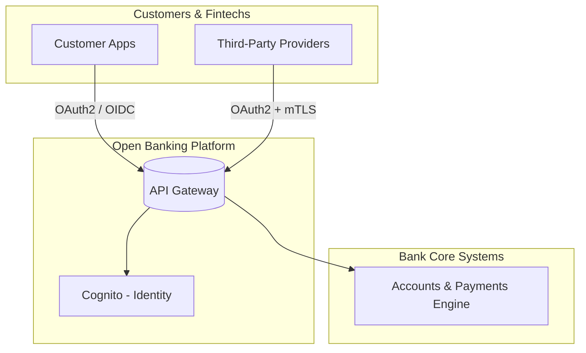

# 01 – Open Banking & API Economy Overview

## 1.1 What Is Open Banking?

Open Banking is a shift from **closed, siloed banks** to **secure, API‑driven ecosystems**.  
Instead of customers interacting only through a bank’s own UI, regulated **third‑party providers (TPPs)** can, with consent, access account and payment data through secure APIs.

### Analogy – The Bank as a Smart City

- **Old world:** A castle with one gate – all services happen at that single door.  
- **Open Banking:** A *smart city* where the government (the bank) publishes **well‑governed roads and doors (APIs)** so licensed businesses (fintechs) can offer services – all under strict rules.

In our lab:

- The **smart doors** are **API Gateway endpoints**.  
- The **identity guard** is **Amazon Cognito**.  
- The **city records** live in **DynamoDB and other data stores**.  
- The **CCTV system** is **CloudTrail + CloudWatch + S3**.

## 1.2 Regulatory Drivers

Many regions introduce Open Banking via regulation:

- **PSD2 (EU)** – banks must provide APIs for account information and payment initiation.  
- **Open Banking UK, CDR (Australia), Brazil Open Finance**, etc.  
- **FAPI (Financial‑grade API)** – a hardened OAuth2/OIDC profile for financial data.

Even if you are outside these regions, the **design patterns** still matter:  
strong identity, consent, logging, rate limiting, and encryption.

## 1.3 Core Actors

- **Bank (ASPSP):** owns the accounts; runs the core systems.  
- **TPP (Third‑Party Provider):** a licensed fintech using bank APIs.  
- **Customer:** owns the data; grants consent to TPPs.  
- **Regulator:** defines and enforces rules for security and privacy.

In this lab we model:

- *The Bank* → your **AWS account + API stack**.  
- *The Customer* → a client calling APIs with user tokens.  
- *The TPP* → a client using OAuth2 client credentials and mTLS.

## 1.4 Technical Pillars of Open Banking

1. **Standardized APIs** – e.g. `/accounts`, `/transactions`, `/payments`.  
2. **Strong Customer Authentication (SCA)** – MFA, device binding, etc.  
3. **Fine‑grained consent & scopes** – customers authorize exactly what is needed.  
4. **Regulatory‑grade logging** – audit trails for “who did what, when”.  
5. **Secure hosting & segmentation** – isolation of sensitive systems.

## 1.5 AWS Mapping

| Pillar                     | AWS Service in the Lab                       |
|----------------------------|----------------------------------------------|
| Standardized APIs         | Amazon API Gateway                            |
| Strong authentication     | Amazon Cognito User Pools + MFA              |
| Consent & scopes          | OAuth2 scopes / JWT claims in Cognito        |
| Logging & audit           | CloudTrail, CloudWatch Logs, S3, Athena      |
| Segmentation & security   | VPC, Security Groups, IAM, KMS               |

## 1.6 Learning Path

We will:

1. Build a **Customer Account API** secured with Cognito (Lab 01).  
2. Introduce **tokenized payments** backed by KMS (Lab 02).  
3. Add **third‑party fintech access** using OAuth2 client credentials + mTLS (Lab 03).  
4. Generate and react to **fraud signals** (Lab 04).  
5. Build **compliance logging & reporting views** (Lab 05).  

By the end you will be able to **explain Open Banking and sketch an AWS architecture** confidently in interviews or design sessions.
