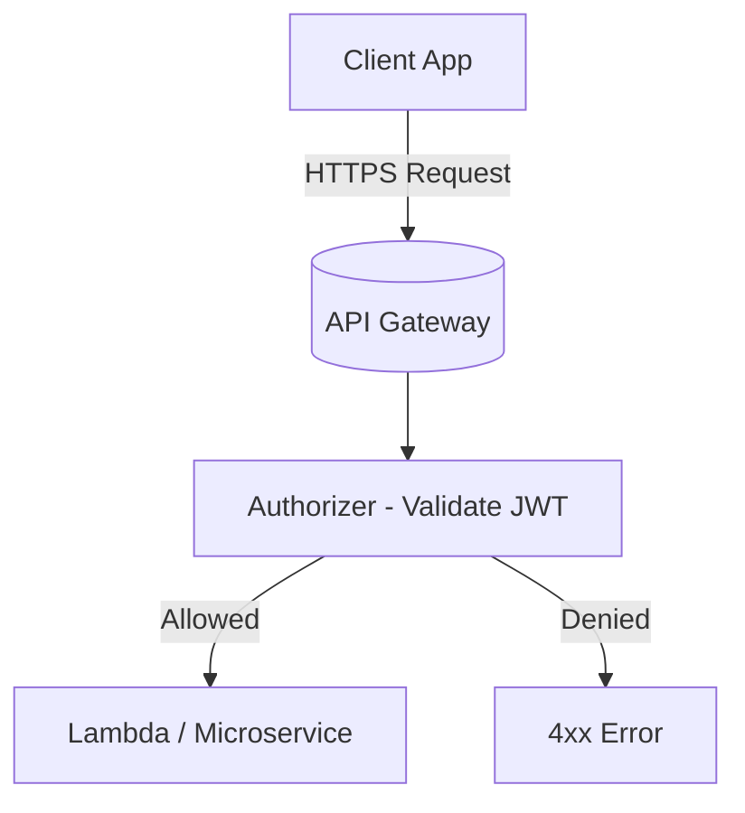
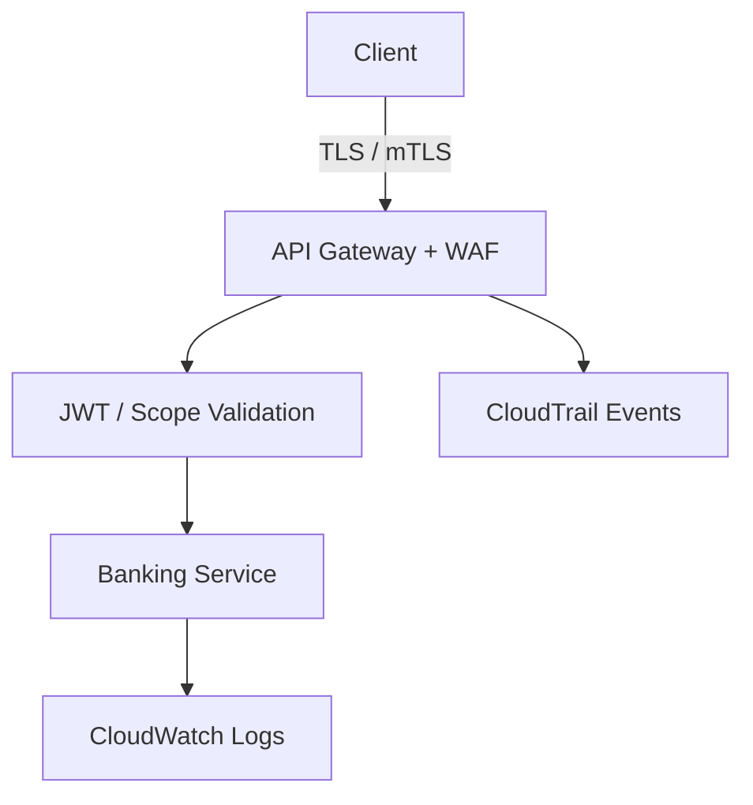

# 02 – API Security Foundations (TLS, OAuth2, mTLS)

## 2.1 Why API Security Matters in Banking

APIs in banking are literally **interfaces to money**. An insecure endpoint can leak:

- Account balances and transaction histories  
- Personally identifiable information (PII)  
- Payment initiation capabilities (moving funds)

We need **layers of defense**, not a single login check.

### Analogy – Airport Security

- **Boarding pass** → OAuth2 access token  
- **Passport** → identity (user / client)  
- **Security checkpoint** → API Gateway authorizer  
- **Customs & restricted zones** → high‑risk APIs like `/payments`

No one boards a plane with a random piece of paper; the boarding pass is validated, tied to an identity, and time‑bound. Tokens must be treated the same way.

## 2.2 TLS – Secure Transport

**Transport Layer Security (TLS)** encrypts traffic between clients and your API:

- Use **TLS 1.2+**.  
- Use strong cipher suites.  
- Force HTTPS (redirect or block HTTP).

On API Gateway this typically means using a **custom domain** with an ACM certificate and optionally enabling **TLS 1.2 minimum**.

## 2.3 OAuth2 / OIDC – Delegated Authorization

Key concepts:

- **Authorization Server:** issues tokens (Cognito User Pool).  
- **Client:** application requesting access.  
- **Resource Owner:** the customer whose data is accessed.  
- **Resource Server:** API Gateway + backend services.  
- **Access Token (JWT):** proves authorization for some **scopes**.  
- **Refresh Token:** allows obtaining new access tokens without re‑auth.

In our labs:

- Customer‑facing apps use **Authorization Code Flow** (simulated).  
- TPPs use **Client Credentials Flow** for server‑to‑server calls.  
- API Gateway validates JWTs via a **Cognito authorizer**.

## 2.4 mTLS – Mutual TLS

With standard TLS, only the server presents a certificate.  
With **mTLS**, both server and client present certs and validate each other.

Why it matters for banking:

- Prevents random clients on the internet from calling high‑value APIs.  
- Ensures only **certified TPPs** (with valid client certs) can connect.  

On API Gateway you configure a **truststore** of acceptable CAs. The TLS handshake fails if the client certificate is not trusted – the request never reaches your code.

## 2.5 Defense in Depth Stack

1. **Network layer:** VPC, subnets, security groups, NACLs.  
2. **Transport layer:** TLS / mTLS.  
3. **Application layer:** OAuth2, scopes, rate limiting.  
4. **Edge protections:** AWS WAF, throttling, usage plans.  
5. **Monitoring:** CloudTrail, CloudWatch logs/metrics, alarms.  

## 2.6 How This Appears in Labs

- **Lab 01:** configure Cognito + JWT authorizer, basic WAF / throttling.  
- **Lab 02:** tighten scopes and permissions for payments.  
- **Lab 03:** add **mTLS** and client credentials for TPPs.  

At each step you will test **failure paths** (expired token, bad scopes, missing cert) so the behavior is intuitive, not mysterious.
