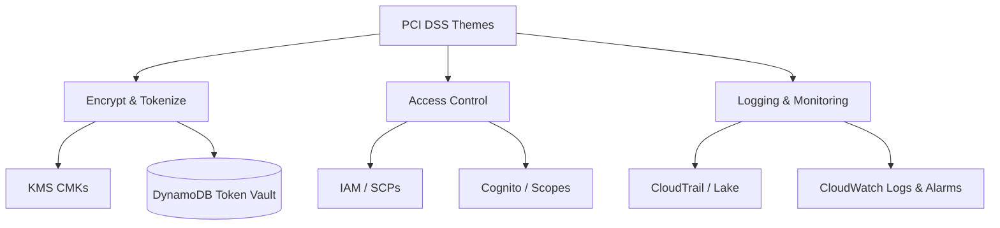

# 03 – AWS Regulatory Controls: PCI, Open Banking & FSI Lens

## 3.1 Thinking Like an Auditor

When you say “this design is secure enough for a bank”, an auditor silently asks:

- *Which requirement does this control satisfy?*  
- *How do you prove it works?*  
- *Where are the logs and evidence?*  

We therefore align our designs with **recognizable frameworks** like **PCI DSS** and AWS’s **Financial Services Industry (FSI) Lens**.

## 3.2 PCI DSS Themes and AWS Mapping

PCI DSS has many detailed controls, but they group into themes:

| Theme                        | Example Requirement                        | Example AWS Services                           |
|------------------------------|--------------------------------------------|-----------------------------------------------|
| Protect card data           | Encrypt PAN at rest and in transit        | KMS, DynamoDB, RDS, S3, TLS                    |
| Strong access control       | Restrict access by business need to know  | IAM, Cognito, SCPs, SGs                        |
| Monitor & test networks     | Track access to network resources & CHD   | CloudTrail, VPC Flow Logs, CloudWatch          |
| Maintain secure systems     | Patch and harden systems                   | SSM, Inspector, ECR scans                      |
| Incident response & logging | Keep logs, detect and respond to attacks  | GuardDuty, Security Hub, CloudWatch Alarms     |

Our labs illustrate mainly:

- Encryption & tokenization (CHD protection).  
- Least‑privilege access control.  
- Logging, monitoring & queryable audit trails.

## 3.3 AWS FSI Lens Mindset

The **FSI Lens** encourages you to:

- Treat regulated workloads as **high criticality**.  
- Use **multi‑account segregation** and **strong boundaries**.  
- Classify data and attach controls based on classification.  
- Ensure resiliency and disaster recovery are deliberate.

We simplify this into a **single‑account lab**, but still think in those terms.

## 3.4 Open Banking Security Expectations

Open Banking security specs (like FAPI) raise the bar:

- TLS 1.2+ with modern ciphers.  
- OAuth2/OIDC best practices (PKCE, reduced token lifetimes, strong client auth).  
- Signed requests / responses (non‑repudiation) in some profiles.  
- Thorough logging & correlation IDs.  

Our architecture is not a full FAPI implementation, but the **controls we use (TLS, OAuth2, mTLS, logging)** are stepping stones.

## 3.5 Control Mapping Diagram

## 3.6 How to Talk About This in an Interview

Example language:

> “We reduce PCI scope by concentrating raw PAN only in a KMS‑backed token vault, exposed through least‑privilege Lambda functions. All KMS usage is logged in CloudTrail and queryable via CloudTrail Lake or Athena for audit.”

In the labs you will implement pieces of this and then answer simple “audit questions” using logs:

- “Show all decrypts on the payment CMK in the last hour.”  
- “Show all failed API auth attempts for `/payments` last week.”  

Being able to **tie concrete AWS services to regulatory goals** is what makes you sound like a banking cloud architect rather than just a general AWS user.
