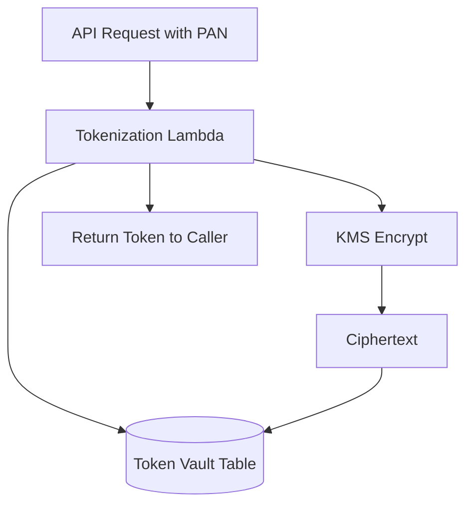
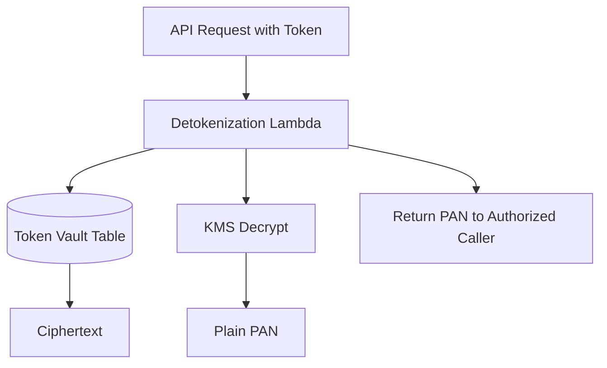

# 04 – KMS Encryption & Tokenization Vault Design

## 4.1 Why Tokenization Instead of Just Encryption?

If you simply encrypt card numbers and store them across many systems, all of those systems are still part of the **Cardholder Data Environment (CDE)**. Auditors care where plaintext **could** appear, not only where it usually does.

**Tokenization** centralizes sensitive values into a **vault**, while other systems use **meaningless tokens**.

### Analogy – Hotel Keycards

- You never receive the **master key** to the hotel.  
- You get a **keycard token** that opens only one room.  
- Losing the card is a problem, but not nearly as bad as losing the master key.

In our design:

- The **keycard** is a random token.  
- The **master registry** is a DynamoDB table that maps tokens → encrypted PAN.  
- Only a tiny set of trusted services can access the registry with KMS.

## 4.2 KMS Core Concepts

- **Customer Managed Key (CMK):** logical key with policy & metadata.  
- **Key policy:** primary access control for using or managing the key.  
- **Grants:** scoped temporary permissions for particular principals.  
- **Envelope encryption:** CMK encrypts data keys; data keys encrypt bulk data.

We will create a dedicated CMK for the **payments vault**, and lock it down so that only specific Lambda roles can call `Encrypt` / `Decrypt`.

## 4.3 DynamoDB Token Vault Schema

Simple design:

| Attribute        | Description                            |
|------------------|----------------------------------------|
| `token` (PK)     | Random unique token value              |
| `ciphertext`     | KMS‑encrypted sensitive data           |
| `created_at`     | Timestamp for auditing                 |
| `metadata`       | e.g. last4, scheme, customer id        |

### Tokenization Flow

### De‑tokenization Flow

## 4.4 Access Control Around the Vault

- Only the **vault Lambdas** should use the CMK.  
- Other services receive **tokens**, not PAN.  
- IAM policies + key policy should deny direct use from other roles.  
- CloudTrail should record each use of the CMK for later review.

## 4.5 Common Mistakes

- Logging PAN or full account numbers in application logs.  
- Allowing wildcards like `Principal: "*"` in key policies.  
- Storing token and plaintext together in the same easily accessible database.  
- Reusing the same CMK for unrelated purposes (no clear scoping).

## 4.6 Lab Outcomes

In **Lab 02 – Tokenized Payments API** you will:

1. Create a CMK dedicated to the token vault.  
2. Create the DynamoDB vault table.  
3. Implement `/tokenize` and `/detokenize` Lambda functions.  
4. Trace KMS usage via CloudTrail to see exactly when the key is used.

You should finish the lab able to describe **how tokenization helps reduce PCI scope** and how KMS, DynamoDB, and Lambda work together.
