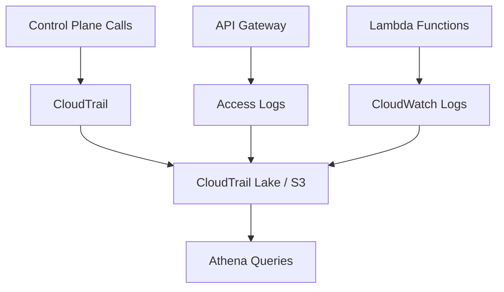

# 05 – Logging, Monitoring & Compliance on AWS

## 5.1 Why Logs Are a First‑Class Feature

For banks, logs are not just debugging tools; they are **evidence**:

- Evidence that security controls were in place.  
- Evidence of who accessed which data and when.  
- Evidence used in fraud investigations and incident response.

## 5.2 Logging Layers in This Lab

We focus on several key sources:

1. **AWS CloudTrail** – records AWS API calls (e.g. `kms:Decrypt`, `lambda:Invoke`).  
2. **API Gateway Access Logs** – detailed info about every API request.  
3. **Lambda Logs (CloudWatch)** – application‑level events and errors.  
4. **Optional: VPC Flow Logs** – network‑level activity.  

## 5.3 CloudTrail & CloudTrail Lake

- **CloudTrail** answers “who did what in AWS?”.  
- **CloudTrail Lake** lets you query logs using SQL‑like syntax.

Example questions:

- “Show all `kms:Decrypt` calls on the payments CMK in the last 24 hours.”  
- “List IAM policy changes in the last 7 days.”  

The labs will guide you to run such queries and interpret the results.

## 5.4 API Gateway Access Logs

Good access logs typically include:

- Request time, HTTP method, path, status code.  
- Client IP or identity (if available).  
- Latency and integration error details.  
- Correlation ID for tracing across systems.

These are essential for:

- Detecting abusive clients / TPPs.  
- Troubleshooting production issues.  
- Proving to auditors that access is monitored.

## 5.5 CloudWatch Metrics & Alarms

From logs we derive metrics and alarms, for example:

- Error rate (`5xx`) > threshold for N minutes.  
- Throttling or WAF blocks for a particular client spike unexpectedly.  
- Lambda function failures increase suddenly.

You will create simple alarms and practice causing/clearing them so the behavior is familiar.

## 5.6 Compliance Perspective

PCI and other frameworks require that you:

- Enable logging for systems that handle sensitive data.  
- Protect logs from tampering.  
- Review logs regularly and respond to anomalies.  

In **Lab 05 – Compliance Logging & Reporting** you will:

1. Confirm CloudTrail is enabled.  
2. Enable API Gateway access logs for banking APIs.  
3. Ensure Lambda logging avoids plaintext sensitive data.  
4. Aggregate logs into S3 / CloudTrail Lake.  
5. Run example queries that could be turned into evidence in a real audit.

By the end, you will not only know **how to turn logs on**, but also how to **ask meaningful security questions** of those logs.
